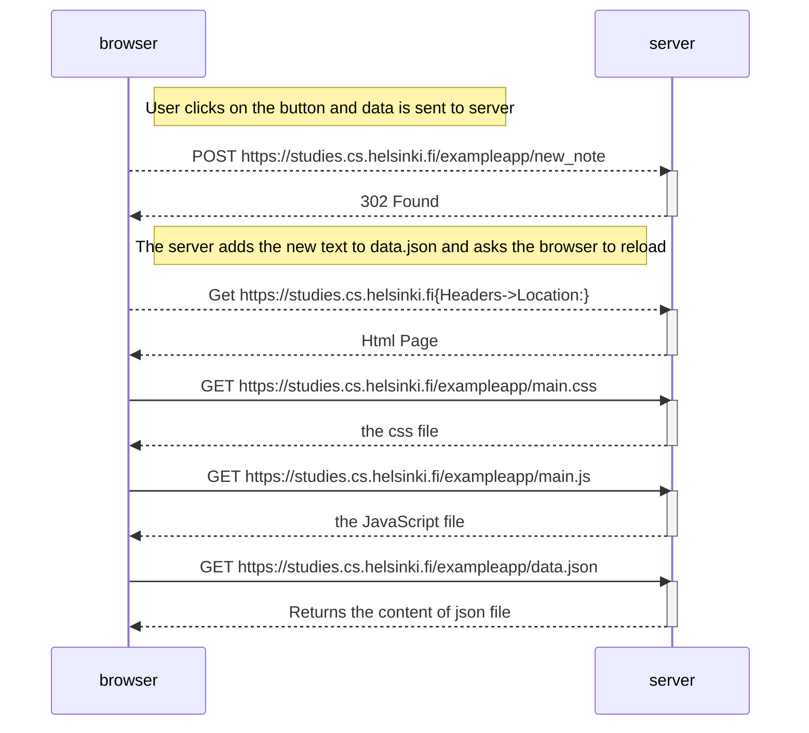

```mermaid
sequenceDiagram
    participant browser
    participant server

    Note right of browser: User clicks on the button and data is sent to server

    browser-->>server: POST https://studies.cs.helsinki.fi/exampleapp/new_note
    activate server
    server-->>browser: 302 Found
    deactivate server

    Note left of server: The server adds the new text to data.json and asks the browser to reload 

    browser-->>server: Get https://studies.cs.helsinki.fi{Headers->Location:}
    activate server
    server-->>browser: Html Page
    deactivate server

    browser->>server: GET https://studies.cs.helsinki.fi/exampleapp/main.css
    activate server
    server-->>browser: the css file
    deactivate server

    browser->>server: GET https://studies.cs.helsinki.fi/exampleapp/main.js
    activate server
    server-->>browser: the JavaScript file
    deactivate server

    browser->>server: GET https://studies.cs.helsinki.fi/exampleapp/data.json
    activate server
    server-->>browser: Returns the content of json file
    deactivate server


    
```