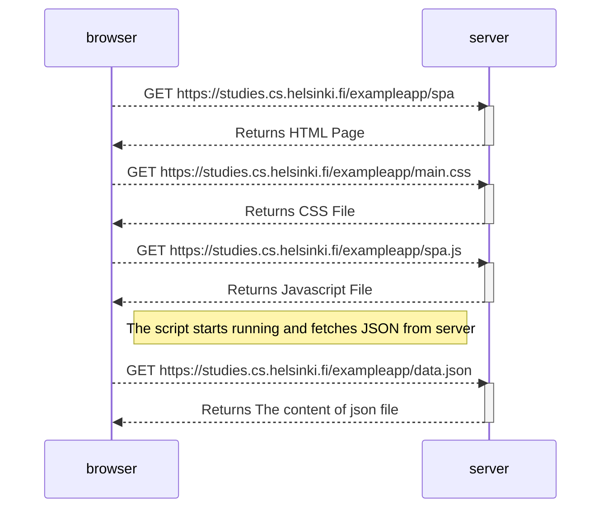

```mermaid

sequenceDiagram
participant browser
participant server

browser-->>server: GET https://studies.cs.helsinki.fi/exampleapp/spa
activate server
server-->>browser: Returns HTML Page
deactivate server

browser-->>server: GET https://studies.cs.helsinki.fi/exampleapp/main.css
activate server
server-->>browser: Returns CSS File
deactivate server

browser-->>server: GET https://studies.cs.helsinki.fi/exampleapp/spa.js
activate server
server-->>browser: Returns Javascript File
deactivate server

Note right of browser: The script starts running and fetches JSON from server

browser-->>server: GET https://studies.cs.helsinki.fi/exampleapp/data.json
activate server
server-->>browser: Returns The content of json file
deactivate server


```