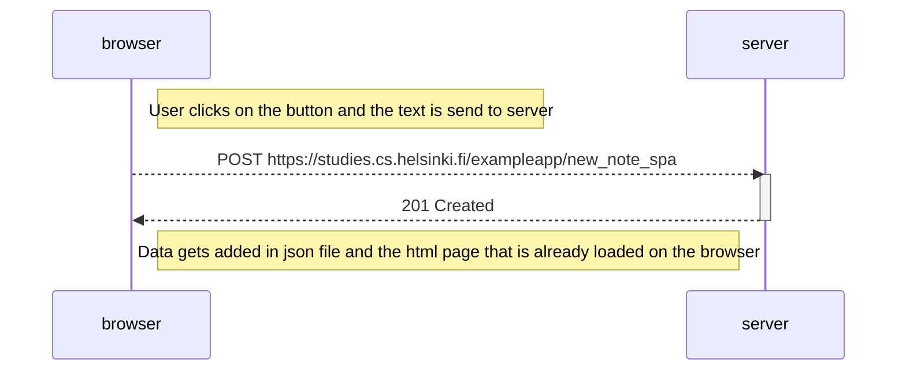

```mermaid
sequenceDiagram
    participant browser
    participant server

    Note right of browser: User clicks on the button and the text is send to server 

    browser-->>server: POST https://studies.cs.helsinki.fi/exampleapp/new_note_spa
    activate server
    server-->>browser: 201 Created
    deactivate server

    Note right of browser: Data gets added in json file and the html page that is already loaded on the browser
    
    
```